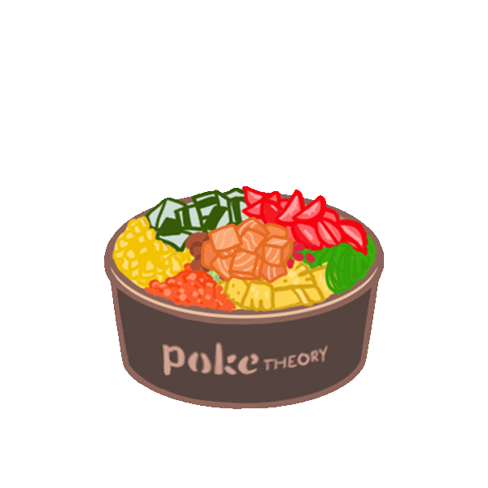

<html>
  <head>
    <title>pokebowling</title>
    </head>
  <body style="background-color: #A8E4A0">
    <header style=" background-color: #A8E4A0; font-family:'Times new roman',Times,serif; padding:0; margin:0; color: rgb(110,38,151); text-align: center;">
    <h1>Two amazing years with my Pookie bear</h1>
    <h2>A trip down memory lane</h2>
    <main>
      <h1>Pokebowling</h1>
        

            <section style="border: 2px solid rgb(110, 38, 151);
  padding: 30px; color: #000000">
              <h2>De lesbische yearning fase - oktober 2024</h2>
              
 De pokebowwwling met Sabel en Vivian, onverwachts waar jij ook zou gaan wonen  

              
 Hier had ik wel al een beetje een oogje op je, en ik was weggeblazen van jouw kookkunsten  

              
 Na de pokebowling vroeg ik buiten aan je met een kloppend hart om samen te gaan thriften.   

              
 Ik was zo blij dat je ja had gezegd tihiiii  

              
 Helaas geen foto's van de avond, maar hierbij een mooie pokebowl  

              
            </section>
        

    </main>
    </header>
  </body>
</html>
