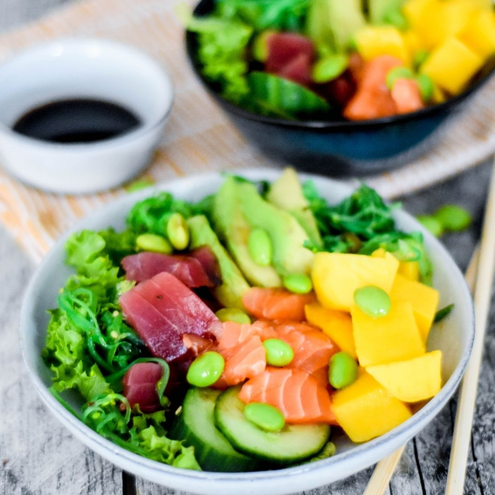

<!DOCTYPE html>
<html>
  <head>
    <title>pokebowling</title>
    </head>
  <body style="background-color: #42FC67">
    <header style=" background-color: #42FC67; font-family:'Times new roman',Times,serif; padding:0; margin:0; color: rgb(110,38,151); text-align: center;">
    <h1>Two amazing years with my Pookie bear</h1>
    <h2>A trip down memory lane</h2>
    <main>
        

            <h1>Pokebowling</h1>
            <section style="border: 2px solid rgb(110, 38, 151);
  padding: 30px; color: #000000">
              <h2>De lesbische yearning fase - oktober 2024</h2>
              
 De pokebowwwling met Sabel en Vivian, onverwachts waar jij ook zou gaan wonen  

              
 En waar ik al een kleine crush op jou had, en weggeblazen was van jouw kookkunsten  

              
 Na de pokebowling vroeg ik je om samen te gaan thriften, daar bij de fietsen  

              
 Ik was zo blij dat je ja had gezegd  

              
 Helaas geen foto's van de avond, maar hierbij een mooie pokebowl  

              
            </section>
        

    </main>
    </header>
  </body>
</html>
